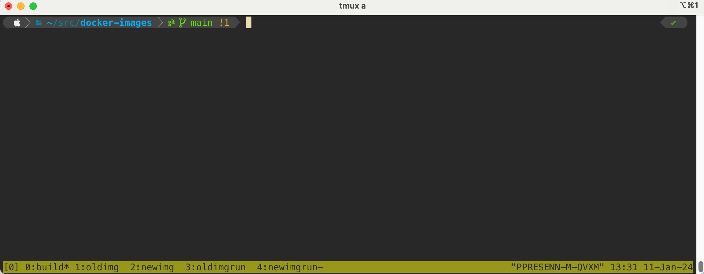

# TMUX

Tmux is a terminal multiplexer I'm finding immensely useful (if you spend a lot of time in the command line).

You can create multiple tmux sessions, and within each session you can create named tabs (called windows) and split-panes. 
You can detach (close-out) from sessions, and attach to an existing session and continue from where you left off. 
You can even attach your local tmux client to a remote tmux session.

**NOTE: By default, sessions are in RAM and will not persist across reboots.** Found it the hard way.

Personally I use a single session, have multiple windows in it (not a big fan of split-panes), detach and attach to it as required.

**A common workflow**: for every new task, create a new window, rename it to something sensible, run the commands required. Even when the commands are running, you can detach from the session and close the terminal. 
Later you can open a new terminal, attach to the previous session and pick up from where you left off.

**A sample session with 5 windows**

# Commands

`tmux new -s<session-name>`: Create a new tmux session. 
I just use `tmux` to create a new session because I plan to have only one session running.

`tmux ls`: List tmux sessions

`tmux a -t<session-name>`: Attach to the specified tmux session. I just use `tmux a` because I usually have only one session running.

# Shortcuts within tmux

`Ctrl-B c`: Create a new window

`Ctrl-B ,`: Rename the current window

`Ctrl-B <num>`: Go to `<num>` window. For example, in the screenshot above, `Ctrl-B 1` would take me to `oldimg` window.

`Ctrl-B d`: Detach from the session. tmux goes away and you get back the usual terminal, feel free to exit.
